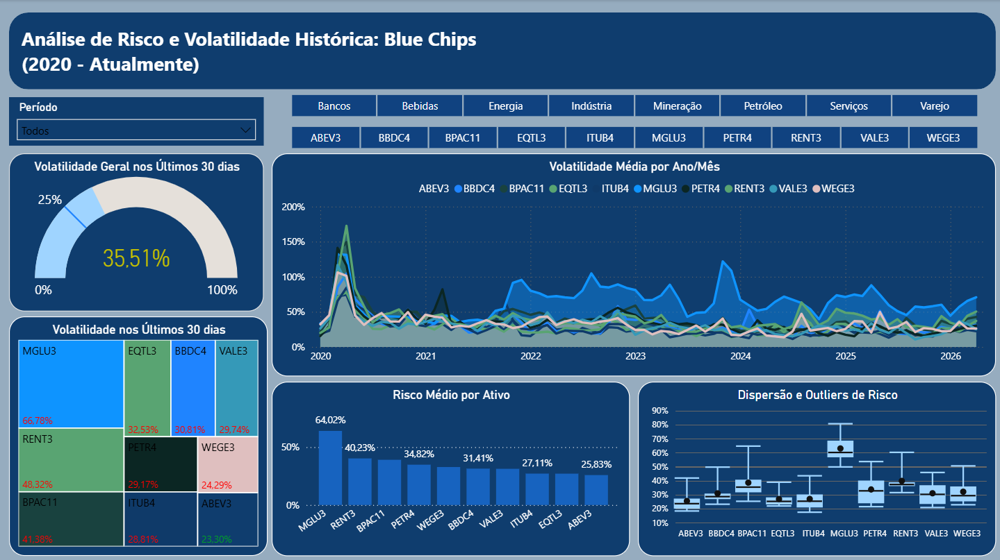

# 📈 Risk & Volatility Analytics: Blue Chips B3

Este projeto consiste em um pipeline de dados ponta a ponta (End-to-End)
para monitoramento estatístico e visual de risco de mercado. Através de 
extração via API e processamento em camadas, a solução entrega insights 
sobre a volatilidade histórica e recente das principais ações da bolsa brasileira.

# 🎯 Objetivo Estratégico
Transformar dados brutos de cotações em métricas de risco (volatilidade anualizada),
permitindo a comparação setorial e a identificação de anomalias (outliers) de mercado
através de uma interface interativa e automatizada.

# 🏗 Arquitetura Medallion (Data Lakehouse)

O projeto foi estruturado seguindo as melhores práticas de engenharia de dados, dividindo
o processamento em três camadas lógicas:Bronze (Raw): Ingestão direta da API yfinance e
persistência em formato Parquet para preservação da integridade dos dados brutos.Silver
(Cleaned): Tratamento de dados ausentes e cálculo de Log-Returns. Aplicação de média móvel
(Rolling Window) de 21 dias para suavização estatística.Gold (Curated): Anualização da
volatilidade ($\sigma \cdot \sqrt{252}$), normalização via pd.melt (Tidy Data) e enriquecimento
com metadados setoriais para análise BI.

# 🛠 Stack Tecnológica
- Python 3.x: Core do processamento.

- Pandas & NumPy: Vetorização de cálculos estatísticos e manipulação de matrizes.

- YFinance: Interface de consumo de dados de mercado financeiro.

- Power BI & DAX: Engine de visualização e cálculos dinâmicos de inteligência temporal.

- PyArrow: Engine de alta performance para escrita de arquivos Parquet.

# 🔄 Pipeline de Dados
### 1. Ingestão e Engenharia de Ativos
- O script utiliza automação via datetime para garantir que o horizonte de análise termine sempre no dia atual (date.today()), eliminando manutenções manuais.

### 2. Cálculo Estatístico de Risco
- Diferente de médias simples, o pipeline calcula a Volatilidade Histórica Móvel.
- Janela: 21 dias úteis (equivalente a um mês comercial).
- Anualização: Ajuste estatístico para base de 252 dias úteis, permitindo a comparação direta com taxas de juros e outros benchmarks.

### 3. Visualização e Storytelling (Power BI)
- O dashboard foi projetado com foco em UX/UI Financeiro (Dark Mode), apresentando:
- Treemap de Risco: Visão hierárquica por setor e ativo nos últimos 30 dias.
- Boxplot de Dispersão: Identificação visual de ativos com alta frequência de outliers.
- Indicador Gauge: "Velocímetro" de risco médio da carteira com formatação condicional.
- DAX Dinâmico: Medidas que recalculam a média de 30 dias com base no contexto de filtro do usuário.

# 📊 Estrutura de Dados (Camada Gold)
| Campo | Descrição |
|-------|-----------|
| Data | Índice temporal da análise |
| Ticket | Índice temporal da análise |
| Volatilidade | Valor anualizado do risco (desvio padrão móvel) |
| Setor | Valor anualizado do risco (desvio padrão móvel) |

# 🚀 Evoluções Futuras
- [ ] Integração com SQL: Migrar os arquivos Parquet para um banco de dados Azure SQL ou BigQuery.

- [ ] Análise de Correlação: Implementar matriz de correlação de Pearson para identificar diversificação de carteira.

- [ ] Calculo de Beta: Adicionar o índice IBOVESPA ao pipeline para calcular a sensibilidade dos ativos ao mercado.

## 👨‍💻 Autor
**Breno Ponciano**  
Foco em Engenharia e Análise de Dados Financeiros